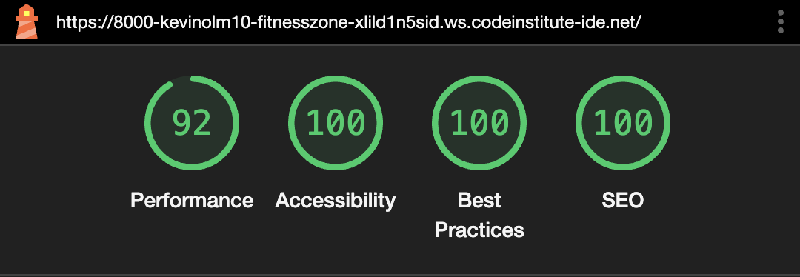

# TESTING

## Compatibility

- Google Chrome:

- Firefox:

- Safari:

## Manual testing

| feature | action | expected result | tested | passed |
| --- | --- | --- | --- | --- | --- |
| NAV | | | | | |
| Home | Clickable link | When Home is pressed, user is redirected to home | Yes | Yes |
| Videos | Clickable Link | When Videos is pressed, user is redirected to Videos | Yes | Yes | 
| Sign Up | Clickable Link | When Sign Up is pressed, user is redirected to Sign up | Yes | Yes | 
| Footer | | | | | |
| Social media icons in footer| Clickable icon | When social media links are pressed, the user is redirected to the corresponding social media | Yes | Yes |
| Home page | | | | | |
| Hyper links on home page | clickable link | When pressed, the user is redirected to the corresponding link | Yes | Yes | 
| Video Page | | | | | |
| Videos | Play and pause the video | The user can play and stop the videos on the page | Yes | Yes | - |
| Sign up page | | | | | |
| First name, Last name and email input box | The user will input the information in textboxes | When the right information is written no error message should appear | Yes | Yes |
| Submit input | Pressing submit should redirect the user to the response page | When seubmit is pressed it should redirect user to response page with thank you message | tested | passed |
| Response page | | | | | |
| show thank you message | Thank you message with relavant information | When pressing submit the user should be taken to a thank you page | tested | passed |

---
## Validator testing

+ ### HTML
#### Home Page

![Home Page HTML Validator] (documentation/w3-index.png)

- No errors shown

#### Video Page

- No errors shown

#### Sign up Page

- No errors shown

#### Respone Page

- No errors shown

+ ### CSS

- No errors shown

## LightHouse Report

### Home Page

 

### Video Page

 

### Response Page

 

---

## Bugs

+ ### Solved Bugs

1. The radio buttons did not work do the name of the groups being wrong.

2. Several issues regarding flex-box in the videos section was solved.

3. A bug with the image on the home page was solved due to the height and width being written in html first.

---

+ ### Unsolved Bugs

- The favicon on the sign up form is not viewed as correct.
---